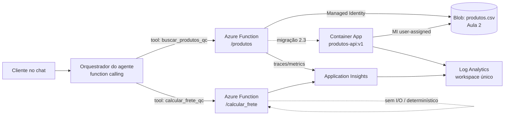

# Entrega Aula 03 — Grupo 08 — Nível 2 (N2)

**Disciplina:** Cloud & Cognitive Environments — FIAP MBA AI Engineering & Multi-Agents
**Turma:** 1AIER
**Data de entrega:** 26/06/2026

> Este documento cobre **exclusivamente a seção 🟡 Nível 2** da Entrega 3
> (Exercícios **2.1**, **2.2** e **2.3**). As seções N1 e N3 são entregues pelos
> demais membros e consolidadas no `entrega-grupo-aula03.md` final do grupo.

## Grupo

| # | Nome completo | GitHub | E-mail FIAP |
|---|---------------|--------|-------------|
| 1 | Tatiana Mastrogiovanni Haddad | https://github.com/TatiHaddad | rm373809@fiap.com.br |
| 2 | Luciana Chaves D'Olivo | https://github.com/l-cdolivo | rm371277@fiap.com.br |
| 3 | Lucas Marujo Amadeu | https://github.com/lucasmarujo | rm370469@fiap.com.br |

## Distribuição do trabalho

| Membro | Nível assumido | Item específico |
|--------|----------------|-----------------|
| **Lucas Marujo Amadeu** | 🟢 N1 + coordenação | Exercícios 1.1, 1.2, 1.3, 1.4; montagem do `entrega-grupo-aula03.md` e ZIP |
| **Luciana Chaves D'Olivo** | 🟡 **N2 (completo)** | **Exercícios 2.1 (tool de frete), 2.2 (App Insights), 2.3 (Container Apps) — este documento** |
| **Tatiana Mastrogiovanni Haddad** | 🔴 N3 (bônus) | Exercícios 3.1 (spec de tool), 3.2 (benchmark), 3.3 (CI/CD + OIDC) |

> **Rodízio (Critério 4):** na Aula 1 o Lucas fez N2 + N3; na Aula 2 rotacionou
> para N1 + parte do N2 (2.2 — migração). Cumprindo a regra "quem fez N1 nas
> Aulas 1-2 assume N2 ou N3 agora", nesta aula ele assume o **N2 completo**.
> A Tatiana, que vinha de N2/coordenação, rotaciona para N1; a Luciana mantém a
> linha técnica avançada no N3 bônus.

---

## 🟡 Nível 2 — Respostas + Implementação

*Responsável: Lucas Marujo Amadeu — Exercícios 2.1, 2.2, 2.3.*

A N2 desta aula tem um fio condutor: a Function da Aula 3 deixa de ser "uma API
de catálogo" e vira o **host das tools que o agente conversacional da QC vai
consumir na Aula 4**. Por isso as três decisões abaixo — uma segunda tool, a
observabilidade dela e onde ela roda (Function vs Container) — são, no fundo,
decisões sobre **como o agente consome ferramentas em produção**.



### Exercício 2.1 — Segunda tool no agente: cálculo de frete

#### a) Nova Function no mesmo Function App, ou Function App separado?

**Decisão: nova função (`calcular_frete`) no MESMO Function App.** Razões:

1. **Mesmo domínio e mesmo dono.** `produtos` e `frete` são tools do mesmo
   agente da QC, com o mesmo ciclo de release e o mesmo time. Mantê-las juntas
   dá **deploy atômico** (um `func publish` versiona as duas tools juntas) e um
   **endpoint base único** para o agente apontar.
2. **Volume baixíssimo.** 50.000 chamadas/mês é ~3% da camada gratuita de 1M
   execuções/mês do plano Consumption (Y1). O custo marginal de adicionar a tool
   no mesmo App é **praticamente zero** — não há razão de custo para um App novo.
3. **Observabilidade compartilhada.** Uma única instância de Application Insights
   (Exercício 2.2) cobre as duas tools, e eu consigo comparar latência/falha
   **por operação** na mesma tela.
4. **Perfis de recurso compatíveis.** Ambas são stateless e leves. A `frete`
   nem toca o Blob (é CPU pura), então **não disputa I/O** com a `produtos` — não
   há "vizinho barulhento" que justifique isolar agora.

Os critérios para a decisão oposta (App separado) estão no item **(e)**.

#### b) Implementação da Function `calcular_frete`

Código em [`function/function_app.py`](function/function_app.py) (continua a
aplicação da Aula 3 — rotas `produtos` e `health` intactas) e a regra de negócio
isolada em [`function/frete_calc.py`](function/frete_calc.py).

**Decisão de design — separar a regra da Function.** O cálculo vive num módulo
**puro** (só stdlib, sem I/O), e a Function só faz parsing HTTP. Isso dá três
ganhos: (1) a regra é **testável offline** sem Azure (17 testes em
[`function/tests/test_frete_calc.py`](function/tests/test_frete_calc.py)); (2) a
tool **responde mesmo se o Blob estiver fora** — frete não depende de Storage nem
de credencial; (3) o mesmo módulo alimenta o script de validação local.

**Modelo (determinístico, como pede o enunciado):** o Brasil é dividido em 10
macrorregiões pelo **primeiro dígito do CEP**; cada região recebe o centroide
(lat/lon) da capital de referência; a distância é a de **Haversine** entre
centroides (intrarregional estimada pelos dígitos seguintes). O valor é
`base + R$/km × distância + R$/kg × peso`, e o prazo é
`teto(distância / 500 km-dia) + 1 dia de processamento`. É uma **heurística
didática** — em produção a distância viria de um geocoder real (API dos
Correios / Azure Maps), mas o contrato da tool não mudaria.

Endpoint (aceita **GET** com query string e **POST** com JSON):

```bash
curl "$HOST/api/calcular_frete?cep_origem=01310-100&cep_destino=20040-002&peso=2.5"
```
```json
{
  "cep_origem": "01310100", "cep_destino": "20040002", "peso_kg": 2.5,
  "distancia_km": 360.7, "valor_frete": 15.83, "moeda": "BRL",
  "prazo_dias_uteis": 2, "metodo": "estimativa-deterministica-regional"
}
```

Entradas inválidas (CEP malformado, peso ≤ 0 ou ausente) retornam **HTTP 400**
com `{"erro": "..."}` — o que também serve para popular o *Failures blade* no
2.2. Saída real do validador offline ([`scripts/calcular_frete_local.py`](scripts/calcular_frete_local.py),
verificada neste pacote):

| Destino | CEP | kg | dist_km | frete R$ | prazo |
|---------|-----|----|---------|----------|-------|
| São Paulo (intrarregional) | 05424-150 | 1,5 | 69,7 | 11,14 | 2d |
| Rio de Janeiro | 20040-002 | 2,0 | 360,7 | 15,23 | 2d |
| Belo Horizonte | 30130-110 | 2,0 | 490,8 | 16,79 | 2d |
| Salvador | 40010-000 | 5,0 | 1454,8 | 31,96 | 4d |
| Recife | 50010-000 | 5,0 | 2131,1 | 40,07 | 6d |
| Fortaleza | 60160-230 | 8,0 | 2369,5 | 46,53 | 6d |
| Porto Alegre | 90010-150 | 3,0 | 852,3 | 22,33 | 3d |

> Os números honram as duas propriedades de negócio que os testes garantem:
> **mais longe ⇒ mais caro/mais lento** e **mais pesado ⇒ mais caro** (sem
> alterar distância nem prazo).

#### c) Terraform — precisa mudar?

**Não.** `calcular_frete` é apenas uma **rota nova no mesmo Function App**, com o
mesmo runtime, a mesma Managed Identity e o mesmo `func azure functionapp
publish`. Nenhum recurso novo, nenhuma permissão nova (frete nem acessa o Blob).
A única mudança de Terraform da N2 é o **Application Insights** do Exercício 2.2 —
não tem relação com a tool de frete. Isso é, aliás, uma evidência prática do
ponto (a): adicionar tool no mesmo App é **mudança de código, não de infra**.

#### d) Documentação como tool (JSON Schema)

Contrato em [`tools/calcular_frete_qc.tool.json`](tools/calcular_frete_qc.tool.json),
no formato **Anthropic Tool Use / OpenAI Function Calling**, ao lado da primeira
tool ([`tools/buscar_produtos_qc.tool.json`](tools/buscar_produtos_qc.tool.json)) —
o catálogo de tools do agente já tem **duas** entradas:

```json
{
  "name": "calcular_frete_qc",
  "description": "Calcula o VALOR do frete (R$) e o PRAZO (dias úteis) de um pedido da Quantum Commerce, a partir do CEP de origem (CD), do CEP de destino (cliente) e do peso total em kg. Use sempre que o usuário perguntar quanto custa o frete, em quanto tempo chega, ou comparar prazos/custos de entrega. NÃO use para preço/estoque de produto — para isso use buscar_produtos_qc. Se faltar CEP de destino ou peso, peça antes de chamar.",
  "input_schema": {
    "type": "object",
    "properties": {
      "cep_origem":  {"type": "string", "description": "CEP de origem (8 dígitos). Default: 01310-100 (CD em SP)."},
      "cep_destino": {"type": "string", "description": "CEP de entrega do cliente (8 dígitos). Obrigatório."},
      "peso_kg":     {"type": "number", "description": "Peso total em kg (>0, máx 100). Obrigatório.", "minimum": 0.01, "maximum": 100}
    },
    "required": ["cep_origem", "cep_destino", "peso_kg"]
  }
}
```

A `description` foi escrita para **ensinar o agente quando usar a tool** (gatilhos
positivos: "quanto custa o frete", "em quanto tempo chega"), quando **não** usar
(perguntas de preço/estoque → outra tool) e o que fazer com input faltando
(perguntar, em vez de chutar). Isso reduz dois erros clássicos de function
calling: **tool errada** e **alucinação de parâmetro**.

#### e) Quando eu criaria um Function App diferente?

Manter no mesmo App é o default; eu **separaria** quando aparece pelo menos um destes:

| Gatilho para separar | Por quê |
|---|---|
| **Perfis de escala muito diferentes** | Se uma tool tem rajadas de milhares de req/s e a outra é esporádica, no mesmo plano elas disputam instâncias — a "barulhenta" degrada a outra. Apps separados escalam de forma independente. |
| **Isolamento de falha / blast radius** | Um deploy ruim ou um bug que estoura memória derruba o *worker* compartilhado — e leva junto as outras tools. App separado limita o estrago a uma tool. |
| **Segurança / identidade distinta** | Se uma tool precisa de uma Managed Identity com permissões bem mais amplas (ex.: escrever em SQL), separar evita que a tool "leve" herde um raio de acesso grande demais (menor privilégio). |
| **Ciclo de vida / ownership diferente** | Times distintos, cadências de release distintas, SLAs distintos. |
| **Runtime / plano diferente** | Uma tool que exige **Premium** (sem cold start, VNet, always-ready) não deveria arrastar para Premium uma tool que ficaria barata no Consumption. |
| **Cold start agregado** | Muitas funções no mesmo App aumentam o tamanho do pacote e o tempo de carga do *worker* — em algum ponto, dividir melhora a latência fria. |

**Para a QC:** as tools de catálogo e frete (e as da Aula 4 — imagem, transcrição,
reviews) devem ser agrupadas **por afinidade de escala e de segurança**, não
"tudo num App" nem "um App por tool". Catálogo + frete + reviews (leitura,
stateless, leves) cabem juntas; uma futura tool de **pagamento/escrita** (alto
risco, identidade ampla, SLA rígido) merece **App próprio**.

---

### Exercício 2.2 — Application Insights e observabilidade

#### a) Terraform: criar o Application Insights e conectar à Function

Em [`terraform/appinsights.tf`](terraform/appinsights.tf) crio um **Application
Insights workspace-based** (o modelo "classic", sem Log Analytics, foi
aposentado pela Microsoft) e um **Log Analytics workspace** compartilhado:

```hcl
resource "azurerm_log_analytics_workspace" "qc" {
  name                = "log-qc-${random_string.sufixo.result}"
  resource_group_name = azurerm_resource_group.rg.name
  location            = azurerm_resource_group.rg.location
  sku                 = "PerGB2018"
  retention_in_days   = 30
}

resource "azurerm_application_insights" "fn" {
  name                = "appi-qc-${random_string.sufixo.result}"
  resource_group_name = azurerm_resource_group.rg.name
  location            = azurerm_resource_group.rg.location
  workspace_id        = azurerm_log_analytics_workspace.qc.id
  application_type    = "web"
}
```

A conexão com a Function é **uma linha** em
[`terraform/function.tf`](terraform/function.tf) (marcada com `[N2.2]`):

```hcl
site_config {
  application_stack { python_version = "3.11" }
  application_insights_connection_string = azurerm_application_insights.fn.connection_string
}
```

O provider injeta `APPLICATIONINSIGHTS_CONNECTION_STRING` no Function App; a
instrumentação é feita pelo runtime do Functions — **sem chave no código**,
coerente com o tema de Managed Identity / segredos-fora-do-código do projeto. O
mesmo workspace serve o Container App (2.3), dando **uma única tela** de
logs/métricas/traces.

> **Validação:** `terraform validate` da base do lab + estes deltas (provider
> azurerm ~3.100) retorna **"Success! The configuration is valid."**.

#### b) 20 chamadas variadas + Live Metrics

O script [`scripts/gerar_carga.py`](scripts/gerar_carga.py) dispara **20 chamadas**
distribuídas entre `/health`, `/produtos` (várias categorias/nomes) e
`/calcular_frete` (vários CEPs/pesos), incluindo **4 falhas propositais** (3× CEP/peso
inválido → HTTP 400, 1× rota inexistente → 404) para popular o **Failures blade**.
Só usa a stdlib (`urllib`), então roda no Cloud Shell sem instalar nada.

O print do **Live Metrics** (capturado durante a carga) vai em
[`diagramas/`](diagramas/README.md). Validei o script ponta-a-ponta contra um
mock HTTP local (a latência abaixo é **localhost**, só prova que o fluxo e as
estatísticas funcionam — **não** representa o Azure):

```
 # rota             status       ms  obs
 1 health              200       21  ok
 8 calcular_frete      200       13  ok
17 calcular_frete      400        1  falha-esperada
20 naoexiste           404       17  falha-esperada
--------------------------------------------------------
Chamadas: 20 | falhas planejadas: 4 (20%) | resultados inesperados: 0
Latencia (ms): media=9  p50=13  p95=17  p99=21  max=21
```

#### c) Leitura do Failures blade e da latência

**% de chamadas que falharam.** Das 20, **4 (20%)** retornam código de falha —
mas é preciso distinguir **4xx de 5xx**. As minhas 4 falhas são **3× HTTP 400**
(input inválido — o agente/cliente mandou CEP ou peso errado) e **1× 404** (rota
inexistente). São **falhas de contrato/cliente, não do serviço**: indicam que a
**validação está funcionando**. A taxa que de fato importa para confiabilidade é
a de **5xx** — num cenário saudável ela é **0%**. Um 5xx só apareceria se, por
exemplo, o Blob caísse e a `/produtos` levantasse o erro 500 do `carregar_produtos`.
Essa separação (erro do cliente × erro do serviço) é exatamente o que o Failures
blade mostra por `resultCode`.

**p95 de latência.** Numa Function **Consumption (Y1)**, o p95/p99 é **dominado
pelo cold start** (~1,5–2,5 s na primeira chamada após ociosidade), enquanto as
chamadas quentes ficam em dezenas de ms. Com as 20 chamadas em rajada, em geral
só a 1ª é fria, então o p95 reflete o estado quente (tipicamente ~50–150 ms),
salvo se o scale-out criar instâncias novas (e frias). **Valores exatos a
confirmar** no *Performance blade → operação → p95* do seu apply — o número certo
sai do servidor (App Insights), não do cliente.

**Onde está o gargalo.** As duas tools têm perfis **diferentes**, e o AI deixa
isso explícito por operação:

- **`/calcular_frete`** não tem I/O — é CPU/parse puro. Quente, é a operação mais
  rápida; o "gargalo" dela é só o **cold start** (carregar o worker Python e o
  `DefaultAzureCredential` no import do módulo).
- **`/produtos`** baixa o `produtos.csv` do Blob **a cada chamada** — o gargalo é
  **I/O de dependência** (visível como *dependency call* ao Storage no AI). A
  otimização óbvia é **cachear o CSV em memória** entre invocações quentes,
  trocando I/O repetido por leitura única por instância.

Ou seja: a observabilidade não é decoração — ela aponta que a próxima
otimização de custo/latência da QC está na `/produtos` (I/O), não na `/frete`.

#### d) Logs/métricas/traces para um sistema multi-agente — OpenTelemetry

**Estratégia ideal:** os **três sinais** correlacionados —
**logs estruturados**, **métricas** e **traces distribuídos** — com um
`trace_id` propagado **ponta a ponta**: do orquestrador do agente → cada tool
(Function/Container App) → cada dependência (Blob, SQL, AI Search, LLM). Em
multi-agente, um único "turno" vira uma **cadeia** de chamadas (o LLM decide →
chama a tool A → a tool B → consulta dados); sem trace distribuído, você só vê
pedaços soltos e não consegue responder *"por que esta resposta demorou 8 s e
custou X tokens?"*.

**OpenTelemetry (OTel)** é o padrão aberto e *vendor-neutral* para esses três
sinais. Por que ele é a escolha certa para a plataforma agentic da QC:

1. **Correlação ponta a ponta** via **W3C Trace Context** — o `trace_id` atravessa
   serviços e linguagens diferentes, então a cadeia inteira do agente vira **um
   único trace** navegável.
2. **Sem lock-in.** A Azure tem a distro **`azure-monitor-opentelemetry`**: você
   instrumenta com a **API padrão do OTel** e exporta para o Application Insights.
   Se amanhã a QC for multi-cloud (discussão da Aula 1), troca-se o **exporter**,
   não o código de instrumentação.
3. **Observabilidade de custo e qualidade do agente.** As *semantic conventions*
   de GenAI (`gen_ai.*`) padronizam atributos de span como modelo, **tokens de
   entrada/saída**, custo e *tool calls* — transformando "o agente está caro/lento"
   numa métrica concreta por trace, e não num palpite.
4. **Controle de custo de ingestão.** *Sampling* (head/tail) para alto volume — o
   próprio `host.json` do lab já liga `samplingSettings`, e em produção isso é o
   que mantém a conta do AI sob controle sem perder os traces que interessam.

Em uma frase: **OTel é a fundação que torna uma cadeia de agentes auditável e
depurável** — e conecta diretamente com o tema de **auditoria/identidade** da
Aula 2 (saber *quem/qual agente* acessou *o quê* exige rastro correlacionado).

---

### Exercício 2.3 — Migrar a Function para Container Apps

Implementação em [`terraform/containerapps.tf`](terraform/containerapps.tf)
(`terraform validate` ✅). Reusa a imagem **`produtos-api:v1`** que já está no ACR
desde a Atividade 3 do lab.

#### a) Container App Environment + Container App

```hcl
resource "azurerm_container_app_environment" "qc" {
  name                       = "cae-qc-${random_string.sufixo.result}"
  resource_group_name        = azurerm_resource_group.rg.name
  location                   = azurerm_resource_group.rg.location
  log_analytics_workspace_id = azurerm_log_analytics_workspace.qc.id  # mesmo workspace do AI
}
```

#### b) Imagem do ACR — sem admin user

O ACI do lab puxava a imagem com **admin user + senha** do ACR. Aqui dou um passo
de maturidade: o Container App usa uma **Managed Identity user-assigned** com a
role **`AcrPull`** no registry e **`Storage Blob Data Reader`** no Storage da
Aula 2 — **sem credencial nenhuma**, no espírito "MI > segredo" da Aula 2:

```hcl
registry {
  server   = azurerm_container_registry.acr.login_server
  identity = azurerm_user_assigned_identity.aca_id.id   # AcrPull, sem admin
}
```

(O `AZURE_CLIENT_ID` da mesma identidade é injetado como env para o
`DefaultAzureCredential` saber qual MI usar dentro do container.)

#### c) Ingress externo na porta 8080

```hcl
ingress {
  external_enabled = true
  target_port      = 8080
  transport        = "auto"   # HTTPS gerenciado no FQDN
}
```

#### d) Scale rules (scale-to-zero + concorrência)

```hcl
template {
  min_replicas = 0   # scale-to-zero
  max_replicas = 10
  http_scale_rule {
    name                = "http-concorrencia"
    concurrent_requests = "50"   # > 50 req concorrentes dispara scale-out
  }
}
```

#### e) Comparação com a Function

| Aspecto | Function (Consumption Y1) | Container App (este 2.3) | ACI do lab (referência) |
|---|---|---|---|
| **HTTPS / certificado** | ✅ nativo (`*.azurewebsites.net`) | ✅ **nativo**, cert **gerenciado pela plataforma** no FQDN `*.azurecontainerapps.io` (TLS terminado no ingress/Envoy do environment) | ❌ só `http://…:8080` — exigia Front Door/App Gateway na frente |
| **Cold start** | 1–3 s (Consumption) | comparável (subir 1 réplica, ~1–4 s) — mas **com botão**: `min_replicas=1` elimina o cold start trocando por custo idle | ❌ não há (réplica sempre ligada) |
| **Custo idle** | $0 (paga por execução) | **$0** com `min_replicas=0` após o *cooldown* (escala a 0 réplicas) | **$$** paga por segundo **mesmo ocioso** (1 réplica fixa) |
| **Auto-scale** | 0→200 (gerenciado) | 0→10 por **concorrência HTTP** (ou KEDA: filas/eventos) | ❌ 1 réplica fixa |
| **Quando brilha** | tools pequenas, event-driven | API "de verdade" containerizada, controle de runtime | job/one-shot |

**Respondendo direto ao enunciado:**

- **A URL pública tem HTTPS? Onde está o certificado?** Sim. O Container Apps
  entrega HTTPS **automático** no FQDN do environment, com **certificado
  gerenciado pela plataforma** (TLS terminado no ingress). É o salto em relação
  ao ACI do lab, que não tinha TLS. Para *custom domain*, traz-se um *managed
  certificate* ou o seu próprio.
- **Cold start: maior, menor ou igual?** Da mesma ordem de grandeza da Function
  no scale-to-zero (ambos ~1–4 s na primeira chamada). A diferença não é o
  número, é o **controle**: o Container Apps deixa você setar `min_replicas≥1`
  para **eliminar** o cold start pagando réplica quente — algo que o Consumption
  não oferece (exigiria Premium/always-ready).
- **Custo idle: zero, como?** Com `min_replicas=0`, após a janela de
  inatividade (*cooldown*, ~300 s por padrão) o app **escala para 0 réplicas** e
  não há vCPU/memória de réplica ativa sendo cobrada — só custos fixos do
  environment/Log Analytics. É o oposto do ACI, cujo ponto fraco era justamente
  **pagar parado**.

#### f) Reflexão — quando Container Apps em vez de Function, para a QC?

Eu escolheria **Container Apps** quando o workload é **container-first**:

- Já existe **imagem Docker** (a `produtos-api:v1` FastAPI), com dependências de
  sistema/binários que não encaixam bem no modelo do Functions, ou quando quero
  **portabilidade** (a mesma imagem roda local, em K8s, em qualquer lugar).
- Preciso de **controle de runtime** que o Functions não dá: framework web full
  (FastAPI/Flask/gRPC), processos *sidecar*, **Dapr**, streaming/long-running,
  microserviços com comunicação service-to-service.
- Quero **scale-to-zero com a opção de réplicas quentes** — o meio-termo que nem
  o ACI (sempre ligado, caro parado) nem a Function Consumption (sem
  *always-warm*) entregam bem.

E manteria **Function** quando a tool é **pequena, event-driven e esporádica**:
menos operação, HTTPS + Managed Identity prontos, e a **camada gratuita de 1M
execuções/mês** cobre o caso. Para a QC concretamente: enquanto a API de catálogo
é uma tool leve com tráfego intermitente, **Function** é a escolha de menor
atrito. Se ela crescer para um microserviço com múltiplas rotas, dependências
pesadas (ex.: uma lib de visão computacional, um modelo local) **ou** precisar de
**latência consistente sob carga sazonal** (Black Friday, com réplicas quentes
prontas), aí a migração para **Container Apps** se paga. As duas convivem: a
Function como host de tools pequenas; o Container Apps como a API "de verdade".

---

## Reflexão técnica (N2)

A pergunta-síntese da rubrica — *como a escolha "Function vs Container" muda a
forma como o agente consome a tool* — atravessa os três exercícios. **Cold start**
não é detalhe de infra: vira **latência percebida no chat**. Se o agente da QC
chama a tool de frete uma vez por hora, várias chamadas serão **frias**, e numa
UX que exige resposta em < 500 ms isso quebra a experiência — daí a importância de
poder trocar custo por latência (Container Apps com `min_replicas≥1`, ou Function
Premium), decisão que só se toma bem **olhando o p95 no Application Insights**.

A **segunda tool** (frete) mostra que o agente da QC já tem um **catálogo
crescente de ferramentas**, e cada uma precisa de um **contrato versionado** (o
JSON Schema do 2.1.d) que ensine o modelo **quando** usá-la — caso contrário o
function calling erra a tool ou alucina parâmetro. Esse contrato é, na prática, a
fronteira entre o mundo probabilístico do LLM e o mundo determinístico da API.

E a **observabilidade** (2.2) é o que torna tudo isso operável: sem traces
correlacionados (OpenTelemetry), uma cadeia de tool calls é uma caixa-preta;
com eles, custo de token, latência e falha viram métricas por operação. Junto com
a Managed Identity da Aula 2 (auditar *quem/qual agente* acessou *o quê*), é o que
permite levar uma plataforma agentic da QC para produção com **previsibilidade,
custo sob controle e auditabilidade** — exatamente as fundações que viemos
construindo desde a Aula 1.

---

## Artefatos do ZIP (parte N2)

- Documento principal desta seção: `respostas-N2-aula03.md` (este arquivo)
- Function evoluída (2.1.b): `function/function_app.py` + `function/frete_calc.py`
- Testes (rodam offline): `function/tests/test_frete_calc.py` — **17 passed**
- Tools em JSON Schema (2.1.d): `tools/calcular_frete_qc.tool.json` + `tools/buscar_produtos_qc.tool.json`
- IaC da N2 (2.2 + 2.3): `terraform/appinsights.tf`, `terraform/containerapps.tf`, `terraform/function.tf`, `terraform/variables-n2.tf`, `terraform/outputs-n2.tf` — `terraform validate` ✅
- Scripts: `scripts/gerar_carga.py` (carga p/ Live Metrics) e `scripts/calcular_frete_local.py`
- Diagrama: visão N2 em Mermaid (acima) + `diagramas/` para o print do Live Metrics
- Como rodar tudo: `README.md`
