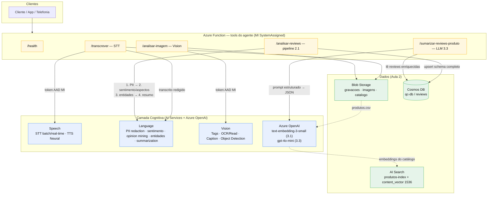

# Arquitetura QC — Aula 4 (camada cognitiva)

Evolução da arquitetura da Quantum Commerce com a **camada cognitiva** adicionada
sobre a base das Aulas 2 (Storage/Cosmos/AI Search) e 3 (Function como tools do agente).
Toda comunicação com serviços cognitivos usa **Managed Identity** (sem chave em código).

## Legenda dos fluxos

| Fluxo | Rota | Serviço cognitivo | Persistência |
|-------|------|-------------------|--------------|
| Voz → texto → análise pós-call (2.2) | `/transcrever` | Speech STT → Language | Cosmos |
| Pipeline robusto de reviews (2.1) | `/analisar-reviews` | Language (PII → opinion mining → entidades → resumo) | Cosmos `reviews` |
| Análise de imagem de produto (1.4/2.3) | `/analisar-imagem` | Vision | — |
| Vector search real (3.1) | script `gerar_embeddings_vector.py` | Azure OpenAI `text-embedding-3-small` | AI Search `content_vector` |
| Síntese por produto (3.3) | `/sumarizar-reviews-produto` | Azure OpenAI `gpt-4o-mini` | lê Cosmos `reviews` |

## Segurança (Ex. 1.3)

Todas as setas para a camada cognitiva usam **token AAD via Managed Identity**, não API key.
Pré-requisitos: `custom_subdomain_name` nos `azurerm_cognitive_account` + roles
`Cognitive Services User` (Language/Vision) e `Cognitive Services OpenAI User` (OpenAI)
atribuídas à MI da Function.
